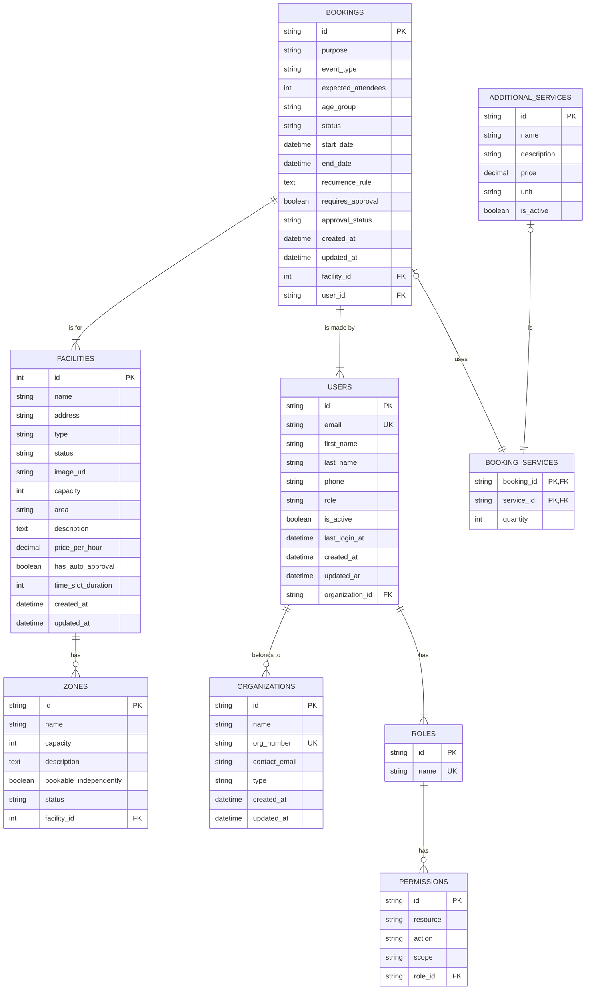

# Data Model & Database Schema

This document defines the data model for the Drammen Booking Portal. It serves as the blueprint for the backend database schema. The model is derived from the TypeScript types defined in the `src/types` directory.

## Overview

The data model is centered around a few core entities: **Users**, **Organizations**, **Facilities**, and **Bookings**. These are supported by several related entities that handle details like pricing, zoning, services, and permissions. The relationships are designed to be normalized to ensure data integrity and flexibility.

## Entity-Relationship Diagram (ERD)

This diagram illustrates the primary entities and their relationships.

## Table Definitions

### 1. `users`
Represents an individual user who can log in and interact with the system.

-   **id (PK):** Unique identifier for the user (e.g., UUID).
-   **email (UK):** User's email address, must be unique.
-   **role:** The assigned role of the user (e.g., `'system-admin'`, `'regular-user'`). Defines their base level of access.
-   **organization_id (FK):** A reference to the `organizations` table if the user belongs to one.

### 2. `organizations`
Represents a company, club, or municipal entity that makes bookings.

-   **id (PK):** Unique identifier for the organization.
-   **name:** The official name of the organization.
-   **org_number (UK):** The official organization number, must be unique.

### 3. `facilities`
Represents a bookable venue or location.

-   **id (PK):** Unique identifier for the facility.
-   **name:** The display name of the facility.
-   **status:** The current operational status (`'active'`, `'maintenance'`).
-   **price_per_hour:** Base price for booking the main facility. Can be overridden by zones.
-   **has_auto_approval:** A flag to determine if bookings for this facility can bypass manual approval workflows.

### 4. `zones`
Represents a specific bookable area within a larger facility (e.g., a single court in a sports hall).

-   **id (PK):** Unique identifier for the zone.
-   **facility_id (FK):** A mandatory reference to the parent `facilities` table.
-   **bookable_independently:** A boolean to indicate if this zone can be booked by itself or only as part of the whole facility.

### 5. `bookings`
The central table that stores all booking information.

-   **id (PK):** Unique identifier for the booking.
-   **status:** The current state of the booking (`'confirmed'`, `'pending'`, `'cancelled'`).
-   **start_date / end_date:** The time range for the booking.
-   **recurrence_rule:** An iCalendar-standard (RFC 5545) RRULE string if the booking is recurring.
-   **facility_id (FK):** The facility being booked.
-   **user_id (FK):** The user who created the booking.
-   **approval_status:** The status within the approval workflow (`'pending'`, `'approved'`, `'rejected'`).

### 6. `additional_services` & `booking_services` (Junction Table)
Defines optional services (like cleaning or equipment rental) and links them to bookings.

-   `additional_services`: Stores the list of available services.
-   `booking_services`: A many-to-many junction table linking `bookings` and `additional_services`, and includes the `quantity` of the service requested for that booking.

### 7. `roles` & `permissions`
Implements Role-Based Access Control (RBAC).

-   **roles:** Defines a set of roles (e.g., 'Facility Manager').
-   **permissions:** Defines specific actions that can be performed on resources (e.g., `action: 'approve'`, `resource: 'booking'`). Each permission is tied to a role. This provides a flexible and granular security model.

This schema provides a solid foundation for the backend database, reflecting the complex needs of the application while maintaining a normalized and scalable structure. 