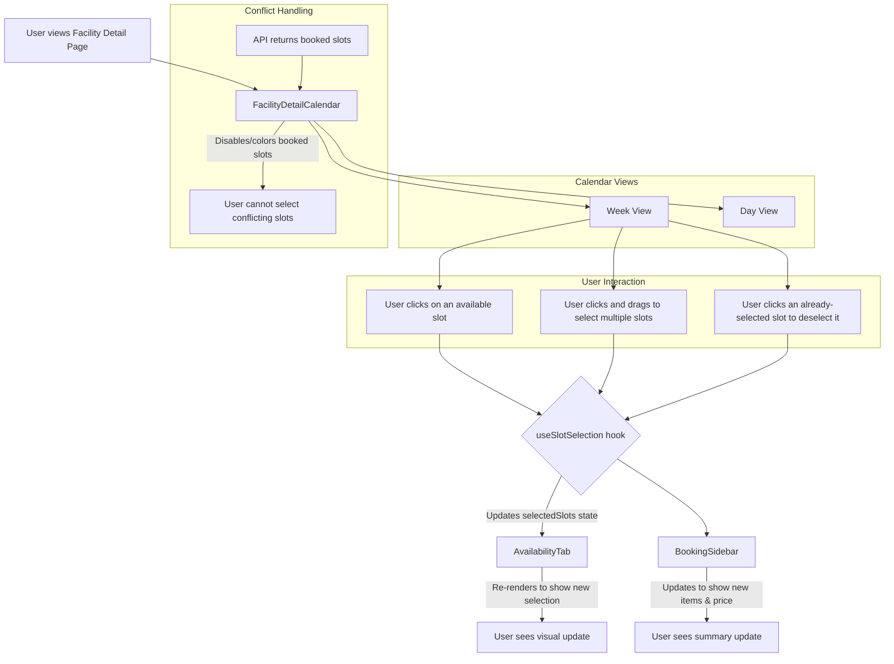

# Feature Specification: Calendar & Availability

This document outlines the functionality and technical specification for the interactive Calendar and Availability system.

## 1. Feature Overview

The Calendar and Availability system is the primary interface for users to understand a facility's schedule and to select the specific time slots they wish to book. It is designed to be a highly visual and interactive component that provides immediate feedback on availability, conflicts, and the user's current selections.

The system is powered by a centralized state management hook (`useSlotSelection`) that ensures selections are kept in sync across all related components, from the calendar grid itself to the booking sidebar.

## 2. User Stories

- **As a user,** I want to see a clear, visual calendar of a facility's schedule so I can quickly understand when it is free and when it is booked.
- **As a user planning a multi-hour event,** I want to click and drag over several consecutive time slots to select them all in one motion, instead of clicking each one individually.
- **As a user,** I want to see a running total of my selected times and the estimated price in a sidebar that is always visible, so I don't lose track of my selections.
- **As a user who made a mistake,** I want to be able to click a selected time slot again to easily deselect it.

## 3. Use Case Scenario: Selecting Multiple Time Slots

- **Actor:** A user planning a half-day workshop.
- **Goal:** Select three consecutive time slots and see the selections reflected in the booking sidebar.
- **Preconditions:** The user is on the facility detail page, viewing the `FacilityDetailCalendar`.

**Step-by-Step Flow:**
1.  **View Calendar:** The user views the `AvailabilityTab`, which shows a grid of time slots for the current week. Some slots are grayed out, indicating they are already booked.
2.  **Initiate Selection:** The user finds an open morning. They press and hold the mouse button on the "09:00 - 10:00" time slot.
3.  **Drag to Select:** While holding the mouse button down, the user drags their cursor downwards over the "10:00 - 11:00" and "11:00 - 12:00" slots. As they drag, each slot becomes highlighted in the primary blue color.
4.  **Confirm Selection:** The user releases the mouse button. The three time slots remain highlighted.
5.  **Sidebar Update:** Simultaneously, the `BookingSidebar` on the right updates. It now displays three new line items under "Valgte tider" (Selected times), one for each selected hour.
6.  **Price Update:** The `BookingPriceCalculation` card within the sidebar updates to show the total price for the 3 hours.
7.  **Deselection:** The user realizes they only need two hours. They click on the "11:00 - 12:00" slot they previously selected.
8.  **State Re-sync:** The "11:00 - 12:00" slot immediately reverts to its normal, un-highlighted appearance. In the sidebar, the corresponding line item is removed, and the total price is recalculated for 2 hours.
9.  **Outcome:** The user has successfully used the interactive calendar to select and amend their desired time slots, with all parts of the UI remaining perfectly in sync.

## 4. Visual Walkthrough

1.  **Initial View:** The user sees a weekly calendar grid. Each cell represents a time slot. Most are white (available), but a few are light gray and have a "Opptatt" (Booked) label.
2.  **Selection Action:** The user positions their mouse over the 9:00 slot on Wednesday. They click and hold. The cell turns blue. They drag the mouse down two cells. As the cursor enters the 10:00 and 11:00 cells, they also turn blue.
3.  **Result of Selection:** Upon releasing the mouse, all three cells remain solid blue. On the right side of the screen, a sidebar, which was previously empty, now shows three items: "Onsdag, 09:00-10:00", "Onsdag, 10:00-11:00", and "Onsdag, 11:00-12:00". The total price reads "600 kr".
4.  **Amending the Selection:** The user moves their mouse back over the 11:00 time slot on the calendar grid and clicks it once. The cell's background immediately turns from blue back to white.
5.  **Synchronized Update:** At the same instant, the "Onsdag, 11:00-12:00" item disappears from the sidebar list, and the total price updates to "400 kr".

## 5. Technical Details

## 6. User Journey & UI Components

The user interacts with this system on the facility detail page.

### Component Breakdown:

-   **`FacilityDetailCalendar`**: The main container component for the entire availability system. It is responsible for fetching the availability data for the facility and passing it down to the appropriate view.
-   **`AvailabilityTab`**: This is the core interactive grid. It renders the time slots for a given period (e.g., a week).
    -   It visually distinguishes between different states for each slot:
        -   **Available:** Standard clickable appearance.
        -   **Booked/Unavailable:** Disabled or grayed-out appearance, not clickable.
        -   **Selected:** Highlighted appearance (e.g., primary brand color) to indicate the user has chosen this slot.
    -   It contains the logic for handling user input, including single clicks and click-and-drag gestures for bulk selection.
-   **`useSlotSelection` Hook**: This is the centralized state manager for this feature. It abstracts all the logic for managing which slots a user has selected.
    -   It exposes a `selectedSlots` array, which is the single source of truth for the user's selections.
    -   It provides handler functions (`handleSlotClick`, `handleBulkSlotSelection`, `clearSelection`) for other components to interact with the state.
    -   Any component that needs to know about the current selections (like the `BookingSidebar`) consumes this hook.
-   **`BookingSidebar` / `EnhancedFacilitySidebar`**: This component consumes the `useSlotSelection` hook to display a summary of the user's selected slots. It re-renders automatically whenever the `selectedSlots` state changes, providing immediate, persistent feedback to the user as they interact with the calendar.
-   **`ConflictTooltip`**: When a user hovers over a slot that is already booked, this component can be used to display a tooltip showing details about the conflicting booking (if permissions allow).

## 7. Business Logic & Rules

-   **Availability Data:**
    -   The frontend is responsible for fetching all existing bookings for a given facility within a specific time frame.
    -   The `GET /bookings?facilityId={id}&startDate=...&endDate=...` endpoint will be used for this purpose.
    -   The `AvailabilityTab` will then use this data to determine which slots to render as "unavailable."
-   **State Synchronization:** The `useSlotSelection` hook is the **only** mechanism that should be used to manage the state of selected slots. This guarantees that the calendar grid and the booking sidebar are always in sync. Direct state manipulation within the components should be avoided.
-   **Bulk Selection Logic (`useDragSelection`):** The click-and-drag functionality is a key usability feature. This is managed by a dedicated `useDragSelection` hook that:
    -   Listens for `mousedown`, `mouseenter`, and `mouseup` events on the time slots.
    -   Keeps track of all slots the user has dragged over.
    -   When the user releases the mouse (`mouseup`), it calls the `handleBulkSlotSelection` function from the `useSlotSelection` hook with the array of all the slots that were selected.
-   **Conflict Prevention:** The UI should prevent users from selecting slots that are already booked. The backend provides the ultimate source of truth, but the frontend should enforce this rule visually to provide a better user experience. During the final booking creation, the backend **must** re-validate all selected slots to prevent any race conditions or client-side manipulation.

This specification ensures the development of a highly interactive, intuitive, and robust calendar system that serves as the primary tool for users to build their bookings. 