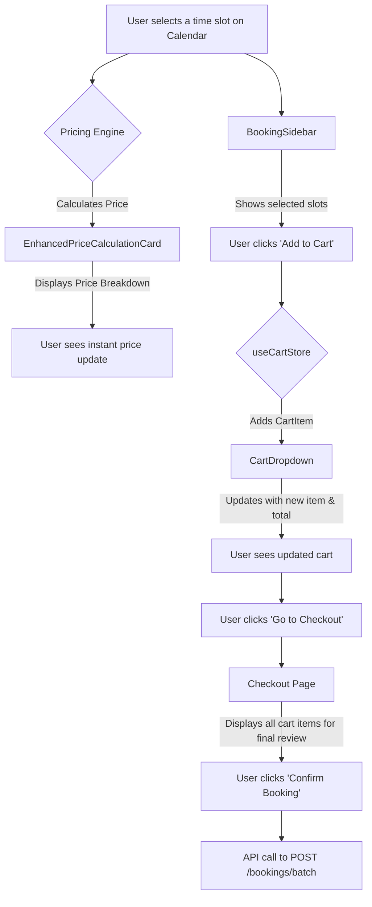

# Feature Specification: Pricing Engine & Cart System

This document outlines the functionality and technical specification for the real-time Pricing Engine and the user-facing Cart System.

## 1. Feature Overview

This system provides users with immediate, transparent feedback on the cost of their selections and a familiar "shopping cart" experience to gather multiple bookings before finalizing them in a single checkout process. The two components are tightly integrated: as a user adds items to the cart, the pricing engine calculates the cost for each item, and the cart store aggregates the totals.

## 2. User Stories

- **As a private person,** I want to see the price update instantly as I select different time slots, so I can make a decision that fits my budget without any surprises.
- **As a manager for a non-profit organization,** I want the system to automatically apply my organization's discount, so I can see the correct, reduced price immediately.
- **As any user,** I want to add multiple, separate bookings for different facilities or dates to a cart, so I can review and pay for them all in one single, efficient transaction.
- **As a user planning an event,** I want a clear breakdown of the price, showing the base cost, any surcharges for peak hours, and the cost of additional services, so I can understand exactly what I am paying for.

## 3. Use Case Scenario: Booking with an Organizational Discount

- **Actor:** A registered user who is a member of a non-profit organization ("Lag/Forening").
- **Goal:** Book a meeting room for a single evening and see the non-profit discount applied correctly before adding it to the cart.
- **Preconditions:** The user is logged in. Their user profile is linked to an organization of type `'lag-foreninger'`.

**Step-by-Step Flow:**
1.  User navigates to the facility detail page for a venue with a meeting room.
2.  On the `AvailabilityTab`, the user selects a single time slot, "19:00 - 21:00", on an upcoming date.
3.  **Pricing Engine Activation:** The `pricingEngine` is triggered instantly by the selection.
4.  **Calculation & Display:**
    *   The `EnhancedPriceCalculationCard` in the sidebar immediately updates.
    *   It displays the full base price, an evening surcharge, and a clearly labeled "Lag/Forening rabatt" line item that subtracts 50% of the base cost.
    *   The final total reflects the discounted price.
5.  **Add to Cart:** Satisfied with the price, the user clicks the "Legg i handlekurv" (Add to Cart) button in the sidebar.
6.  **Cart Update:**
    *   An item is added to the `useCartStore`.
    *   The `CartDropdown` in the global header updates its item count from "0" to "1".
7.  **Review:** The user clicks the `CartDropdown`. A small popover appears, showing the meeting room booking, the selected date/time, and its final, discounted price.
8.  **Outcome:** The user has successfully added a correctly priced item to their cart and can now either continue browsing to book other facilities or proceed to checkout.

## 4. Visual Walkthrough

1.  **Selection:** The user is viewing the "Drammensbiblioteket" facility page. On the weekly calendar view, they click the "19:00 - 21:00" slot for "Møterom 3". The slot immediately turns blue to indicate it is selected.
2.  **Instant Price Feedback:** Simultaneously, the `BookingPriceCalculation` component in the right-hand sidebar, which previously showed "Velg tid for å se pris" (Select time to see price), now animates with the new calculation.
3.  **Price Breakdown:** The user sees the following lines appear in the price card:
    *   `Grunnpris (Møterom 3, 2 timer): 400 kr`
    *   `Kveldstillegg (30%): +120 kr`
    *   `Rabatt (Lag/Forening): -200 kr`
    *   A bold line at the bottom shows `Totalsum: 320 kr`.
4.  **Adding to Cart:** The user clicks the prominent "Legg i handlekurv" button. The button shows a brief loading spinner and then turns into "Lagt til!" (Added!).
5.  **Header Update:** The shopping cart icon in the top-right corner of the page now displays a small red badge with the number "1".
6.  **Cart Review:** The user clicks the cart icon. A dropdown appears, showing a card with the facility name, the selected room, date, and time, and the final price of `320 kr`.

## 5. Technical Details

### Pricing Engine

The backend **must** create a mirror implementation of the frontend's `pricingEngine.ts`.

-   **Rule-Based Calculation:** The engine is not a simple `price * time` formula. It is a pipeline of rules that are applied sequentially:
    1.  **Base Price:** Get the `pricePerHour` from the specific `Zone` being booked.
    2.  **Duration Calculation:** Calculate the total hours and number of days.
    3.  **Actor Type Multiplier:** Apply a discount or surcharge based on `who` is booking (e.g., a 50% discount for registered associations).
    4.  **Booking Type Multiplier:** Apply a discount based on `why` they are booking (e.g., a 10% discount for a long-term lease).
    5.  **Time-Based Multiplier:** Apply surcharges for peak hours (evenings) and weekends.
-   **Transparency:** The engine's output must be a `PriceCalculation` object that includes a `breakdown` array. This allows the UI to show the user exactly how their total was calculated (e.g., "Base Price: 500 kr", "Evening Surcharge: +150 kr", "Association Discount: -250 kr").
-   **Backend Authority:** While the frontend engine provides instant feedback, the **backend's pricing engine is the source of truth**. During the final checkout (`POST /bookings/batch`), the backend must re-calculate the price for every item in the cart to prevent any client-side manipulation. If the prices do not match, the transaction should be rejected.

### Cart System

-   **Client-Side Management:** The cart is managed entirely on the client side by `useCartStore` until the point of checkout. This provides a fast and responsive user experience.
-   **Batch Checkout:** The user journey culminates in a single action: confirming the booking. At this point, the frontend sends the entire array of `CartItem` objects to a dedicated backend endpoint: `POST /bookings/batch`.
-   **Transactional Integrity:** The backend must process the batch checkout as a single, atomic transaction.
    1.  Loop through each `CartItem` in the request.
    2.  For each item, perform a final conflict check.
    3.  For each item, perform an authoritative price calculation.
    4.  Create a `bookings` record for each item.
    -   If any item fails its conflict check or price validation, the entire database transaction must be rolled back, and a detailed error message must be returned to the user explaining which item caused the failure.

By adhering to this specification, the system ensures a transparent and predictable pricing experience for the user, while maintaining strong data integrity and security on the backend.

## 6. User Journey & UI Components

The user interacts with this system across the facility detail and booking pages.

### Component Breakdown:

-   **`EnhancedPriceCalculationCard` / `BookingPriceCalculation`**: This UI component is a key part of the facility detail sidebar. Its sole purpose is to display the output of the Pricing Engine. It is not responsible for the calculation itself but for rendering the price breakdown, discounts, surcharges, and final total in a clear, user-friendly format. It is re-rendered every time the user's selections change.
-   **`useCartStore` (Zustand Store)**: This is the client-side "brain" of the cart. It's a global store that holds an array of `CartItem` objects. It is responsible for:
    -   Adding new items.
    -   Removing items.
    -   Updating items (e.g., changing the number of attendees).
    -   Persisting the cart's state to `localStorage` so it survives page reloads.
-   **`CartDropdown`**: A header component that visually represents the state of the `useCartStore`. It typically shows the number of items in the cart and, when clicked, displays a summary of the items.
-   **Checkout Page (`/checkout`)**: A dedicated page that takes the final state of the `useCartStore` and presents it to the user for one last review before they confirm their booking.

## 7. Business Logic & Rules

### Pricing Engine

The backend **must** create a mirror implementation of the frontend's `pricingEngine.ts`.

-   **Rule-Based Calculation:** The engine is not a simple `price * time` formula. It is a pipeline of rules that are applied sequentially:
    1.  **Base Price:** Get the `pricePerHour` from the specific `Zone` being booked.
    2.  **Duration Calculation:** Calculate the total hours and number of days.
    3.  **Actor Type Multiplier:** Apply a discount or surcharge based on `who` is booking (e.g., a 50% discount for registered associations).
    4.  **Booking Type Multiplier:** Apply a discount based on `why` they are booking (e.g., a 10% discount for a long-term lease).
    5.  **Time-Based Multiplier:** Apply surcharges for peak hours (evenings) and weekends.
-   **Transparency:** The engine's output must be a `PriceCalculation` object that includes a `breakdown` array. This allows the UI to show the user exactly how their total was calculated (e.g., "Base Price: 500 kr", "Evening Surcharge: +150 kr", "Association Discount: -250 kr").
-   **Backend Authority:** While the frontend engine provides instant feedback, the **backend's pricing engine is the source of truth**. During the final checkout (`POST /bookings/batch`), the backend must re-calculate the price for every item in the cart to prevent any client-side manipulation. If the prices do not match, the transaction should be rejected.

### Cart System

-   **Client-Side Management:** The cart is managed entirely on the client side by `useCartStore` until the point of checkout. This provides a fast and responsive user experience.
-   **Batch Checkout:** The user journey culminates in a single action: confirming the booking. At this point, the frontend sends the entire array of `CartItem` objects to a dedicated backend endpoint: `POST /bookings/batch`.
-   **Transactional Integrity:** The backend must process the batch checkout as a single, atomic transaction.
    1.  Loop through each `CartItem` in the request.
    2.  For each item, perform a final conflict check.
    3.  For each item, perform an authoritative price calculation.
    4.  Create a `bookings` record for each item.
    -   If any item fails its conflict check or price validation, the entire database transaction must be rolled back, and a detailed error message must be returned to the user explaining which item caused the failure.

By adhering to this specification, the system ensures a transparent and predictable pricing experience for the user, while maintaining strong data integrity and security on the backend. 