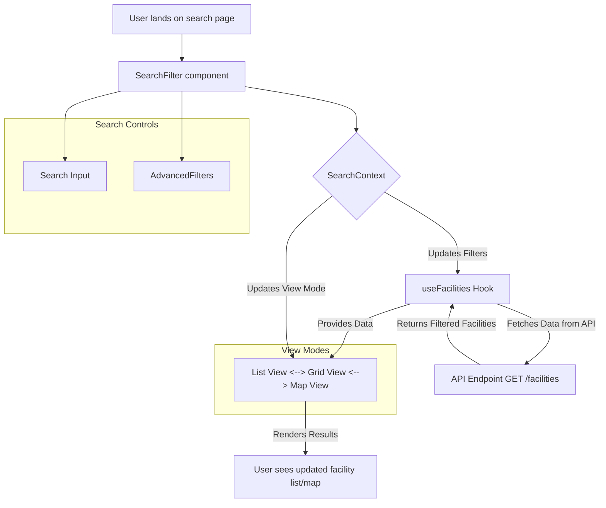

# Feature Specification: Search & Discovery

This document outlines the functionality and technical specification for the facility Search and Discovery features of the Drammen Booking Portal.

## 1. Feature Overview

The Search and Discovery system is the primary tool for users to find suitable facilities. It is designed to be a flexible and powerful system that allows users to explore the available venues through multiple lenses: a traditional list view, a visual grid view, and a geographical map view. A comprehensive set of filters allows users to narrow down the results to their specific needs.

The state of the search (filters, view mode, pagination) is managed centrally by a `SearchContext`, ensuring a seamless and consistent experience as the user switches between different views.

## 2. User Stories

- **As a parent looking for a birthday party venue,** I want to search for facilities that are available next Saturday and can accommodate at least 20 children, so I can quickly find suitable options.
- **As a wheelchair user,** I want to filter the facility list to only show venues that have wheelchair accessibility, so I can be sure the location meets my needs.
- **As a new resident,** I want to see the available facilities on a map, so I can understand which ones are closest to my home.
- **As a user on a budget,** I want to sort the search results by price from lowest to highest, so I can easily find the most affordable options first.

## 3. Use Case Scenario: Finding an Accessible Venue

- **Actor:** A user planning a small community event who requires a wheelchair-accessible location.
- **Goal:** Find a facility in the "Fjell" area that is available on a specific Saturday and has wheelchair access.
- **Preconditions:** The user is on the main facility search page.

**Step-by-Step Flow:**
1.  **Initial Search:** The page loads, displaying all facilities in a default grid view.
2.  **Applying Filters:** The user interacts with the `AdvancedFilters` component.
    *   They select "Saturday, October 23rd" from the `DateRangePicker`.
    *   They select "Fjell" from the "Område" (Area/Location) dropdown.
    *   They check the box for "Rullestoltilgang" (Wheelchair Access) under the "Tilgjengelighet" (Accessibility) section.
3.  **Dynamic Update:** With each filter selection, the `SearchContext` is updated. This triggers the `useFacilities` hook to re-fetch data from the `GET /facilities` API with the new query parameters (e.g., `?date=...&location=...&accessibility=...`).
4.  **View Results:** The grid of facilities automatically updates to show only the 3 venues that match all the specified criteria.
5.  **Switching Views:** The user wants to see where these 3 venues are located relative to each other. They click the "Map" icon in the view-switcher control.
6.  **Map Display:** The view animates to the `MapView` component. The map is centered on the "Fjell" area and displays only 3 pins corresponding to the filtered results.
7.  **Exploration:** The user clicks on a pin. A small popup appears showing the facility's name, image, and price, with a "View Details" button.
8.  **Outcome:** The user has successfully identified a suitable, accessible venue in their desired location and on their chosen date, and can now proceed to the facility detail page to book.

## 4. Visual Walkthrough

1.  **Starting Point:** The user sees a grid of `FacilityCard` components. Above the grid is the `SearchFilter` bar with a search input and a button labeled "Flere filtre" (More Filters).
2.  **Filtering:** The user clicks "Flere filtre". A dropdown `AdvancedFilters` menu appears. The user picks a date from a small calendar, selects "Fjell" from a list of locations, and ticks the "Rullestoltilgang" checkbox. As they make these selections, they can see the grid of facilities in the background shrinking and re-shuffling in real-time.
3.  **Viewing Results:** After closing the filter menu, the user sees a much smaller set of results. A text above the grid now reads "Viser 3 av 25 lokaler" (Showing 3 of 25 facilities).
4.  **Changing View:** To the right of this text are three icons: list, grid, and map. The grid icon is currently active. The user clicks the map icon.
5.  **Map Interaction:** The page transitions to a large, interactive map. The user can see three distinct pins on the map. They click one, and a small info card slides into view from the bottom of the map, containing a picture of the facility and key details.

## 5. Technical Details

## 6. User Journey & UI Components

The user journey begins on the main landing page or a dedicated search page, where they are presented with the search interface.

### Component Breakdown:

-   **`SearchFilter`**: The main container for all search and filter controls.
    -   **`GlobalSearch`**: A simple text input for keyword-based searching.
    -   **`AdvancedFilters`**: A component (often in a dropdown or modal) that contains more specific filter controls, such as:
        -   `DateRangePicker`: To find facilities available on a specific date.
        -   Sliders for capacity and price.
        -   Checkboxes for amenities and accessibility options.
        -   Dropdowns for facility type and location.
-   **`SearchContext` / `useSearch`**: A React Context that acts as the single source of truth for the entire search state. It manages:
    -   The current values of all filters.
    -   The current view mode (`'list'`, `'grid'`, `'map'`).
    -   The current sorting options.
    -   The current page number for pagination.
    When any of these values change, the context notifies its consumers, triggering a new data fetch.
-   **View Components**:
    -   **`FacilityList` / `FacilityGrid`**: These components are responsible for rendering the search results. They consume the search state from the `SearchContext`, call the `useFacilities` hook to get the data, and display the results as either a vertical list or a card-based grid. They also include `PaginationControls`.
    -   **`MapView`**: This component displays facilities as pins on an interactive map (e.g., Mapbox or Google Maps). It also subscribes to the `SearchContext` and will update the pins on the map whenever the filters change. Clicking a pin on the map will show a summary of the facility and a link to its detail page.

## 7. Business Logic & Rules

-   **Centralized State:** All filter and view state **must** be managed by the `SearchContext`. This prevents state desynchronization between the filter components and the view components.
-   **Efficient Data Fetching:**
    -   The `useFacilities` hook is the workhorse of this feature. It listens to changes in the `SearchContext`.
    -   When a filter changes, the hook automatically constructs the correct query parameters and makes a new API call to the `GET /facilities` endpoint.
    -   This hook should use `TanStack Query` to handle caching, prevent redundant API calls, and manage loading/error states.
-   **API Endpoint (`GET /facilities`):** The backend API must be robust enough to handle all combinations of filters provided by the frontend.
    -   It should accept query parameters for every filter (e.g., `?searchTerm=...`, `&minCapacity=...`, `&amenities=...`).
    -   The endpoint should be optimized for performance, with proper database indexing on all filterable columns.
-   **View Persistence:** The user's selected view mode (`list`, `grid`, or `map`) should be persisted, either in `localStorage` or in the `SearchContext` itself, so that their preference is remembered as they navigate the site.

This architecture creates a powerful, responsive, and user-friendly search experience that is also efficient and scalable. The decoupling of the search state (`SearchContext`), data fetching (`useFacilities`), and presentation (`View Components`) makes the system easy to maintain and extend with new filters or views in the future. 