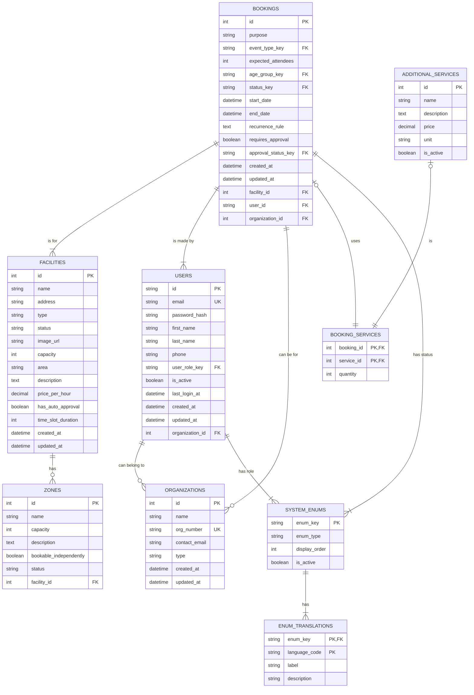

# Drammen Booking Portal: System Architecture & Technical Blueprint

This document provides a comprehensive technical blueprint for the Drammen Booking Portal. It is designed to be the single source of truth for building a production-ready backend that is perfectly synchronized with the existing frontend application.

## Part 1: High-Level Architecture

The system is designed as a modern, decoupled web application.

```mermaid
graph TD
    subgraph Browser
        A[React Frontend]
    end

    subgraph "Cloud Infrastructure"
        B[Backend API Server<br>(e.g., Node.js/Express, .NET)]
        C[PostgreSQL Database]
        D[Object Storage<br>(e.g., S3, Azure Blob) for images/attachments]
    end

    A -- "REST API Calls (JSON)" --> B;
    B -- "Reads/Writes" --> C;
    B -- "Manages Files" --> D;
```

-   **Frontend:** A React Single-Page Application (SPA) built with Vite and TypeScript. It is responsible for all UI rendering and user interaction.
-   **Backend:** A stateless RESTful API server. It handles all business logic, authentication, and communication with the database.
-   **Database:** A PostgreSQL database that serves as the persistent store for all application data.
-   **Object Storage:** A service for storing large binary files like facility images and booking attachments.

---

## Part 2: Detailed Data Model & Schema

This data model includes not just the core database tables but also the enumerations and configuration tables required to drive the application's dynamic content.

### Entity-Relationship Diagram (ERD)



### Key Table Definitions

-   **`users`**, **`organizations`**, **`facilities`**, **`zones`**, **`bookings`**: These core tables are as defined in the previous documentation. `bookings` now also links to `organizations`.
-   **`system_enums`**: This is a critical table for making the application configurable.
    -   **enum_key (PK):** The programmatic key for the enum (e.g., `'pending-approval'`).
    -   **enum_type:** The category of the enum (e.g., `'BookingStatus'`, `'UserRole'`). This allows grouping related enums.
-   **`enum_translations`**: Provides the human-readable labels for each enum in multiple languages.
    -   **enum_key (PK, FK):** Links to `system_enums`.
    -   **language_code (PK):** The language of the translation (e.g., `'NO'`, `'EN'`).
    -   **label:** The translated text to display in the UI.

This design allows an administrator to add a new `EventType` by simply adding a row to `system_enums` and its translations to `enum_translations`, with no frontend deployment required.

---

## Part 3: Core Business Engines (Backend Logic)

These logic engines must be implemented on the backend to ensure data integrity and consistency. The frontend's implementations in the `src/utils` directory serve as the definitive specification.

### 1. Pricing Engine

-   **Location:** `src/utils/pricingEngine.ts`
-   **Function:** `calculatePrice(...)`
-   **Inputs:** `facilityId`, `zoneId`, `dates`, `actorType`, `bookingType`, `timeSlot`, etc.
-   **Logic:** The backend must implement a pricing function that replicates the frontend logic exactly:
    1.  Start with the base `pricePerHour` for the selected `Zone`.
    2.  Calculate the total duration in hours and days.
    3.  Apply a multiplier based on the `ActorType` (e.g., 50% discount for `'lag-foreninger'`).
    4.  Apply a multiplier based on the `BookingType` (e.g., 10% discount for `'fastlan'`).
    5.  Apply a multiplier based on the time of day (e.g., 30% surcharge for evenings).
    6.  Apply a multiplier for weekends.
    7.  Return a full `PriceCalculation` object, including a line-item breakdown.

### 2. Recurrence Engine

-   **Location:** `src/utils/recurrenceEngine.ts`
-   **Function:** `generateOccurrences(...)`
-   **Logic:** When a booking is created with a recurrence pattern, the backend must:
    1.  Use the `RecurrenceEngine` logic to generate all future occurrence dates based on the pattern (e.g., "every second Monday until a given end date").
    2.  For each generated date, perform a **conflict check**.
    3.  If there are no conflicts, create a separate `bookings` record in the database for each occurrence, all linked by a common `recurrence_id`.
    4.  If there are conflicts, the entire transaction should fail, returning the conflicting dates to the user.

---

## Part 4: Data Flow & State Management

### 1. Frontend State
-   **UI State:** Handled locally within components via `useState` and `useReducer`.
-   **Global State (Client-Side):** `Zustand` is used for managing global state that needs to be accessed by multiple components but is not fetched from the server.
    -   **`useCartStore`**: Manages the list of booking items before checkout.
    -   **`useAuthStore`**: Manages the user's authentication token and profile.
-   **Server State (Cache):** `TanStack Query` (`@tanstack/react-query`) is the primary tool for fetching, caching, and synchronizing server data. All data fetching hooks (`useFacilities`, `useBookings`) should use `useQuery` or `useInfiniteQuery`. Mutations (creating/updating data) should use `useMutation`.

### 2. Data Access Layer (DAL) & Production Readiness Plan

The current DAL uses the **Repository Pattern**, which is the key to making the application production-ready.

-   **Current State:** The repositories in `src/dal` (`FacilityRepository`, `BookingRepository`) extend a `BaseRepository` that operates on in-memory mock data arrays.
-   **Future State (Production):** The logic inside each repository method will be replaced with `fetch` calls to the live backend API.

#### **Production Migration Plan (Step-by-Step):**

1.  **Backend Development:** Build the backend API server and database according to the `API Specification` and `Data Model` defined in this document.
2.  **Environment Variables:** Create a `.env` file to store the base URL of the backend API (`VITE_API_BASE_URL`).
3.  **Implement `ApiRepository`:** Create a new `ApiRepository.ts` that extends `BaseRepository`. This new repository will implement the CRUD methods (`findAll`, `findById`, `create`, `update`) by making `fetch` calls to the corresponding API endpoints. It will handle adding the `Authorization` header, formatting requests, and parsing JSON responses.
4.  **Refactor Concrete Repositories:** Change each concrete repository (e.g., `FacilityRepository`) to extend `ApiRepository` instead of `BaseRepository`. The mock data arrays will be removed. The constructor will be updated to pass the resource path (e.g., `'/facilities'`) to the `ApiRepository` constructor.
5.  **Remove Mock Data:** The `src/data` directory can be removed entirely once all repositories are converted.
6.  **Testing:** Perform end-to-end testing to ensure all parts of the frontend are correctly interacting with the live backend.

By following this plan, the data source can be swapped from mock data to a live API with **zero changes** required in the service layer (`src/services`) or the UI components (`src/components`, `src/pages`), demonstrating the power of the chosen architecture.

---

## Part 5: Supporting Systems

### Cart System

-   **Location:** `src/stores/useCartStore.ts`
-   **Logic:** The cart is a client-side concept. When the user proceeds to checkout, the frontend will take the array of `CartItem` objects from the `useCartStore` and make a single API call to a batch booking endpoint:
    -   **`POST /bookings/batch`**
    -   **Request Body:** `{ items: CartItem[] }`
    -   The backend will then process each item in the array, creating multiple `bookings` records in a single database transaction.

This comprehensive blueprint provides a clear path forward for developing a robust, scalable, and production-ready Drammen Booking Portal. 